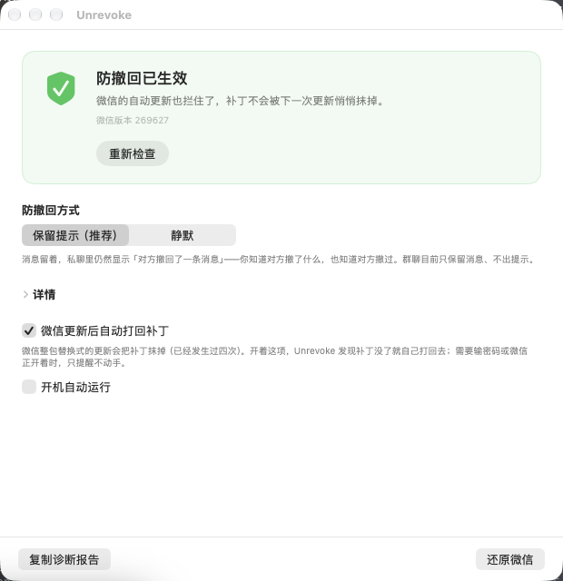

# Unrevoke

[English](README.md) | **中文**

macOS 上给微信打防撤回补丁的图形界面：一个按钮，自己认版本，微信更新后自己打回去。

[](LICENSE)
[](#运行要求)
[](#支持哪些版本)



---

## 为什么会有这个东西

这件事大家一直用的是 [`sunnyyoung/WeChatTweak`](https://github.com/sunnyyoung/WeChatTweak)
（13.8k star、1.6k fork）。它**最后一次提交停在 2026 年 2 月**，而微信 4.x 把消息逻辑整个搬进了
`Contents/Resources/wechat.dylib`，它知道的补丁点全部失效。

[`zengtianli/WeChatTweak`](https://github.com/zengtianli/WeChatTweak) 接了下去：找出 4.x 的补丁点、
写入前先校验原始字节、重签名时不把 entitlements 弄丢。**Unrevoke 就是它的图形界面。**

命令行版对人的要求其实不低：自己去表里查构建号、自己判断该跑哪条子命令、微信每次更新后记得再跑一遍。
这个 app 就是这三件事的答案——它自己读版本，只给你一个按钮，微信把补丁换掉时它自己打回去。

## 它做什么

| | |
|---|---|
| **自己认版本** | 不用查表。你这台机器上的微信构建号在不在收录范围内，它直接告诉你。 |
| **只有一个按钮** | 按钮上写的字就是按下去会发生的事，没有第二个决定要做。 |
| **扛得住微信更新** | 微信是整包替换式更新，补丁会被抹掉，已经发生过四次。Unrevoke 发现了就打回去。 |
| **顺手拦住自动更新** | 两个补丁一起打，下一次更新没法把你悄悄还原回去。 |
| **一键还原** | 把每个补丁点写回原始字节并重新签名，微信恢复原样，自动更新也一起恢复。 |
| **出事说人话** | 版本没收录、字节对不上、签名权限掉了、微信还开着——每种都有一句解释和一条出路，不是一堆报错。 |
| **新微信版本不用更新 app** | 补丁点存在从 GitHub 拉取的 `config.json` 里，新版本被收录后，你装着的这份自己就能拿到。 |

### 两种防撤回方式

- **保留提示**（默认）——消息留着，**并且**私聊里仍然显示「对方撤回了一条消息」。
  你既知道对方撤了什么，也知道对方撤过。群聊目前只保留消息、不出提示（[原因](https://github.com/zengtianli/WeChatTweak)）。
- **静默**——消息留着，完全不显示撤回提示。

## 安装

**没有签名版本**。用 Apple 开发者 ID 签它，等于把一个真实开发者身份绑到「修改别家客户端」的工具上，
所以这里不做。代价是 macOS 默认不让它打开——这是 Gatekeeper 在正常工作，不是 bug：

```bash
# 把 Unrevoke.app 拖进 /Applications 之后
xattr -dr com.apple.quarantine /Applications/Unrevoke.app
```

或者右键点 app →**打开**→ 在弹出的对话框里再点一次**打开**。

**更建议自己编译**（一共 1000 行左右 Swift，看得完）：

```bash
git clone https://github.com/zengtianli/WeChatTweak     # 引擎
git clone https://github.com/zengtianli/Unrevoke        # 本 app
cd Unrevoke
ENGINE_REPO=../WeChatTweak ./build.sh
```

`build.sh` 会把引擎编成 universal 二进制、嵌进 app、adhoc 签名、装到 `/Applications`。
引擎不是双架构它拒绝打包，嵌进去的引擎跑不起来它拒绝收工。

## 运行要求

- macOS 15 及以上，Apple Silicon 或 Intel 都行
- Mac 版微信，见[支持哪些版本](#支持哪些版本)
- **不用关 SIP、不装内核扩展、不留任何 root 常驻进程**

## 支持哪些版本

引擎按**构建号**（`CFBundleVersion`）匹配，不是营销版本号。目前 `config.json` 收录 37 个构建号，
覆盖微信 4.x 的 `268575` 到 `269627`，外加老的 3.8.x 线。你的版本在不在里面，app 会直接写在界面上。

还没收录的，它会明说「还没有」，而不是猜一个地址写下去。补新版本的方法见
[引擎仓库的 README](https://github.com/zengtianli/WeChatTweak)。

## 它怎么工作，以及它不会做什么

Unrevoke 自己一个字节都不碰微信。所有读写都经内嵌的 `wechattweak` 二进制，它会：

1. 拿你的构建号去 `config.json` 里匹配，认不出来就拒绝动手；
2. **写入前先把当前字节和「预期的原始字节」对一遍**——版本不对、或者别的工具已经改过，
   直接中止，而不是把二进制写坏；
3. 重签名时**保住 entitlements**（沙盒、team identifier、app-group 授权）。
   直接 `codesign --deep --sign -` 会把这些剥掉，而丢了 entitlements 的微信在开着 SIP 的机器上
   **根本起不来**——这正是上游 issue #1038 里那批人遇到的事。

**不往任何地方发送东西。** 全程唯一的网络请求是从本项目的 GitHub 仓库拉 `config.json`；
拉回来解不成 JSON、或者收录的版本比你手上这份还少，就丢弃不用。

打补丁需要对 `/Applications/WeChat.app` 的写权限。微信 4.1.13 起这个包归你所有，不用输密码；
更老的版本会在你按下按钮的那一刻弹系统标准授权框要一次管理员密码。**不装特权 helper，
事后不留任何 root 进程。**

## 老实说的几条限制

- **群聊不出撤回提示**，即便选了「保留提示」。消息保住了，提示没有。
  根本矛盾是 `newmsgid` 同时控制「删哪条消息」和「群聊提示插在哪」，清零它保住了消息也丢了提示。
  要修得动态（lldb）定位一个虚派发的删除调用，那是另一个工程。
- **没有签名、没有公证**，见[安装](#安装)。
- **防撤回唯一的真实验证方式是收到一条被撤回的消息。** app 只能告诉你补丁打上了，
  没法替你验证微信的行为。
- **微信大约每月更新两次。** 遇上还没收录的版本，诚实的回答就是「还没有」，
  界面上写的也会是这句。

## 致谢与许可

基于 [sunnyyoung/WeChatTweak](https://github.com/sunnyyoung/WeChatTweak)。4.x 的 `keeptip`
思路参考了 [fzlzjerry/wechat-antirecall](https://github.com/fzlzjerry/wechat-antirecall)。

**AGPL-3.0**，继承自上游。这意味着你运行的每一部分都必须能拿到源码——包括嵌在 app 里的引擎，
它的源码在[这里](https://github.com/zengtianli/WeChatTweak)。

这个工具修改的是不属于你的客户端，违反微信的服务条款。它是给那些想把别人发给自己的消息
留在自己电脑上的人用的。在你自己的电脑上用，风险自负。
