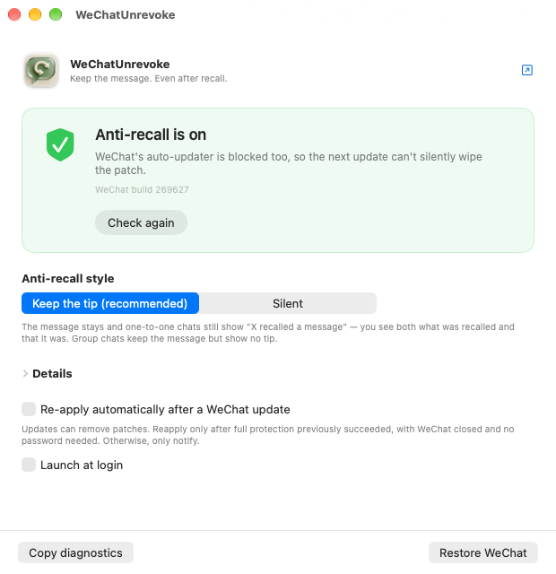

# WeChatUnrevoke

[中文](README.md) | **English**

A one-click macOS app that stops WeChat from deleting recalled messages — and stops WeChat's
own updater from quietly undoing it. *(The app itself shows up as **Unrevoke** in your Dock.)*

[](LICENSE)
[](#requirements)
[](#supported-versions)



---

## Why this exists

[`sunnyyoung/WeChatTweak`](https://github.com/sunnyyoung/WeChatTweak) is the tool everyone used
for this — 13.8k stars, 1.6k forks. Its last commit was **February 2026**, and WeChat 4.x moved
the message logic out of the main binary into `Contents/Resources/wechat.dylib`, which broke
every patch point it knew about.

[`zengtianli/WeChatTweak`](https://github.com/zengtianli/WeChatTweak) picked that up: it locates
the 4.x patch points, verifies the original bytes before writing anything, and re-signs the
bundle without stripping its entitlements. **Unrevoke is the graphical front end for it.**

The command line still asks a lot of you: read your build number off a table, pick the right
subcommand, remember to re-run it after every WeChat update. This app is the answer to all
three — it reads the build itself, gives you one button, and puts the patch back on its own
when WeChat replaces it.

## What it does

| | |
|---|---|
| **Reads your build itself** | No version tables. It tells you whether your exact WeChat build is covered. |
| **One button** | The button text is always what will happen next — nothing else to decide. |
| **Survives WeChat updates** | A WeChat update replaces the whole bundle and wipes the patch. It has done that four times. Unrevoke notices and puts it back. |
| **Blocks the auto-updater** | Both patches go in together, so the next update can't silently revert you. |
| **One-click restore** | Writes every patch point back to its original bytes and re-signs. WeChat returns to stock, updater and all. |
| **Says what went wrong in plain words** | Wrong build, foreign bytes, stripped entitlements, WeChat still running — each gets an explanation and a way out, not a stack trace. |
| **New WeChat versions without an app update** | Patch points live in a `config.json` fetched from GitHub. When a new WeChat build is covered, your installed copy picks it up on its own. |

### Two anti-recall styles

- **Keep the tip** (default) — the message stays **and** one-to-one chats still show
  "X recalled a message". You see both what was recalled and that it was.
  Group chats keep the message but show no tip ([why](https://github.com/zengtianli/WeChatTweak)).
- **Silent** — the message stays and no recall tip appears at all.

## Install

### Homebrew

```bash
brew install --cask zengtianli/tap/wechat-unrevoke
xattr -dr com.apple.quarantine /Applications/Unrevoke.app
```

### Or download the release

There is no signed release, because signing this with an Apple Developer ID would tie a real
developer identity to a tool that modifies another vendor's app. So macOS will not open it
until you say so — that is Gatekeeper doing its job on an unsigned app, not a bug:

```bash
# after dragging Unrevoke.app into /Applications
xattr -dr com.apple.quarantine /Applications/Unrevoke.app
```

(Homebrew 6 removed `--no-quarantine`, so the `xattr` line is needed either way.)

Or right-click the app → **Open** → **Open** in the dialog.

If you would rather build it yourself (recommended — it is ~1000 lines of Swift):

```bash
git clone https://github.com/zengtianli/WeChatTweak     # the engine
git clone https://github.com/zengtianli/WeChatUnrevoke  # this app
cd WeChatUnrevoke
ENGINE_REPO=../WeChatTweak ./build.sh
```

`build.sh` builds the engine as a universal binary, embeds it in the app, ad-hoc signs, and
installs to `/Applications`. It refuses to package a single-architecture engine and refuses to
finish if the embedded engine won't run.

## Requirements

- macOS 15 or later, Apple Silicon or Intel
- WeChat for Mac — see [supported versions](#supported-versions)
- No SIP changes. No kernel extensions. No background daemon running as root.

## Supported versions

The engine tracks WeChat by **build number** (`CFBundleVersion`), not the marketing version.
As of now `config.json` covers 37 builds, including WeChat 4.x from `268575` through `269627`,
plus the legacy 3.8.x line. Unrevoke shows you plainly whether your build is one of them.

If yours is not covered yet, the app says so instead of guessing — see
[the engine README](https://github.com/zengtianli/WeChatTweak) on adding a build.

## How it works, and what it will not do

Unrevoke itself never touches a byte of WeChat. Every read and write goes through the embedded
`wechattweak` binary, which:

1. matches your build against `config.json` and refuses if it is unknown;
2. **checks the current bytes against the expected originals before writing** — a wrong build,
   or another tool's patch, aborts instead of corrupting the binary;
3. re-signs the bundle **keeping its entitlements** (the app sandbox, the team identifier, the
   app-group grants). A bare `codesign --deep --sign -` strips those, and a WeChat without them
   will not launch at all on a machine with SIP enabled.

Nothing is sent anywhere. The only network request the app makes is fetching `config.json`
from this project's GitHub repository, and a response that doesn't parse — or that knows fewer
builds than the copy you already have — is discarded rather than installed.

Patching needs write access to `/Applications/WeChat.app`. On WeChat 4.1.13 and later the bundle
is owned by you and no password is asked. On older ones the app asks for an administrator
password at the moment you press the button, through the standard macOS dialog. There is no
privileged helper installed and nothing left running as root afterwards.

## Honest limitations

- **Group chats show no recall tip**, even in "keep the tip" mode. The message is kept; the tip
  is not. The `newmsgid` that controls "which message to delete" also controls where the group
  tip gets inserted, so zeroing it saves the message and loses the tip. Fixing that needs a
  dynamic (lldb) location of a virtually-dispatched delete call — a separate piece of work.
- **This is not signed or notarized.** See [Install](#install).
- **Anti-recall can only really be tested by receiving a recalled message.** The app tells you
  the patch is applied; it cannot tell you WeChat behaves.
- **WeChat updates roughly twice a month.** When a build isn't covered yet, the honest answer is
  "not yet" — and that is what the app will say.

## Credits & license

Built on [sunnyyoung/WeChatTweak](https://github.com/sunnyyoung/WeChatTweak). The 4.x `keeptip`
approach follows [fzlzjerry/wechat-antirecall](https://github.com/fzlzjerry/wechat-antirecall).

**AGPL-3.0**, inherited from upstream. That means the source of everything you run must stay
available — including the engine binary embedded in the app, whose source is
[here](https://github.com/zengtianli/WeChatTweak).

This modifies a client you do not own, which is against WeChat's terms of service. It is
published for people who want to keep messages sent to them on their own machine. Use it on
your own computer and at your own risk.
